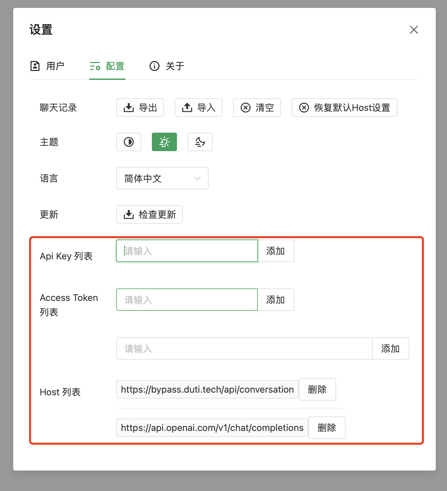
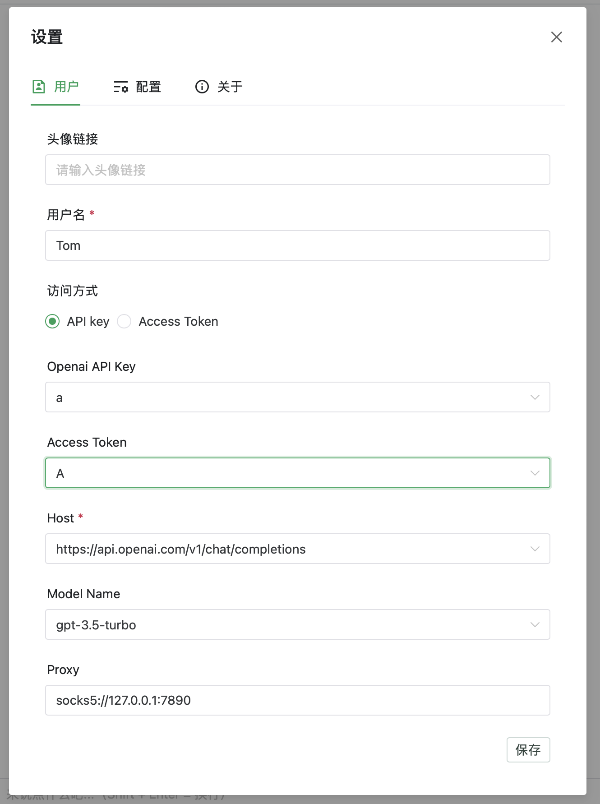

# ChatGPT Tauri
ChatGPT 桌面客户端，基于 [chatgpt-web](https://github.com/Chanzhaoyu/chatgpt-web)。

__该客户端支持 open-api 和 access token 的方式使用__

## 预览





## 介绍

### 开发

```bash
pnpm i

# 开发
pnpm tauri dev

# 打包
pnpm tauri build
```


## 感谢

- 感谢 [chatgpt-web](https://github.com/Chanzhaoyu/chatgpt-web) 项目作者以及所有该项目的贡献者。
- 感谢 [ChatGPT-T](https://github.com/pljhonglu/ChatGPT-T) 项目作者以及所有该项目的贡献者。

# License
MIT
